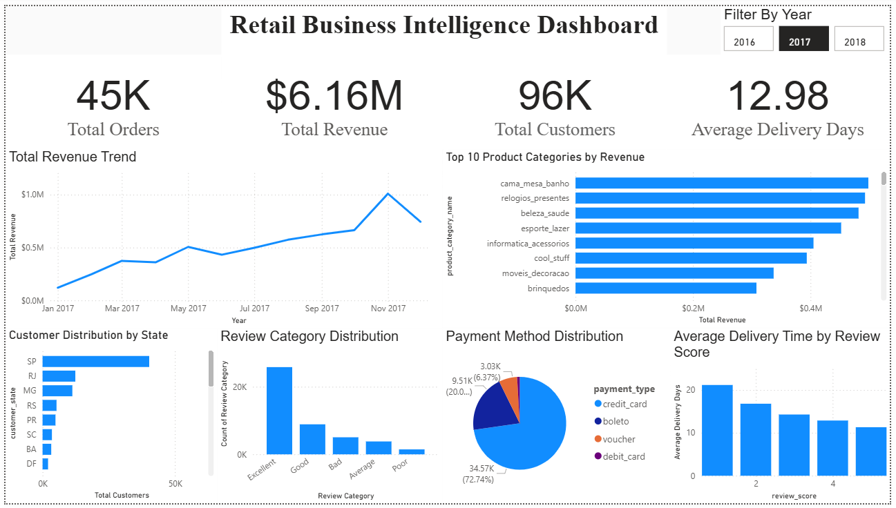

# 🛍️ Retail Business Intelligence Dashboard

An end-to-end **Business Intelligence & Sales Analytics** project built using **SQL, Python, and Power BI** to analyze retail sales data, uncover business insights, and create an interactive executive dashboard.

---

# 📌 Project Overview

This project demonstrates the complete data analytics workflow:

- Extracting business insights using SQL
- Performing data cleaning and exploratory data analysis (EDA) using Python
- Building interactive dashboards using Power BI
- Answering real-world business questions using data

The project analyzes sales performance, customer behavior, payment methods, product categories, delivery performance, and customer satisfaction.

---

# 🛠️ Tech Stack

- SQL (SQLite)
- Python
- Pandas
- Matplotlib
- Jupyter Notebook
- Power BI
- Git & GitHub

---

# 📂 Project Structure

```
Retail-Business-Intelligence-Dashboard
│
├── Documentation/
│
├── Images/
│   └── dashboard.png
│
├── PowerBI/
│   └── Retail_Business_Intelligence_Dashboard.pbix
│
├── Python/
│   ├── 02_Data_Cleaning.ipynb
│   ├── 03_Exploratory_Data_Analysis.ipynb
│   └── 04_Business_Insights.ipynb
│
├── SQL/
│   ├── 01_Basic_Queries.sql
│   ├── 02_Intermediate_Queries.sql
│   └── 03_Advanced_Queries.sql
│
├── README.md
└── .gitignore
```

---

# 📊 Business Questions Answered

The project answers important business questions such as:

- How many total orders were placed?
- How many unique customers does the business have?
- Which states have the highest number of customers?
- Which product categories generate the highest revenue?
- How does monthly revenue change over time?
- Which payment methods are used the most?
- What is the average delivery time?
- Does delivery time affect customer review scores?
- Which review categories are most common?

---

# 📈 Power BI Dashboard

The dashboard includes:

### KPI Cards

- Total Orders
- Total Revenue
- Total Customers
- Average Delivery Time

### Interactive Visualizations

- Monthly Revenue Trend
- Top 10 Product Categories by Revenue
- Customer Distribution by State
- Payment Method Distribution
- Review Category Distribution
- Average Delivery Time by Review Score
- Year Filter

---

# 📸 Dashboard Preview



---

# 🔍 Key Business Insights

- Revenue showed a consistent upward trend during 2017.
- Credit Card is the most preferred payment method.
- São Paulo has the highest customer base.
- Health & Beauty products generate the highest revenue.
- Longer delivery times are associated with lower customer review scores.
- Most customer reviews fall under the "Excellent" category.

---

# 📊 SQL Analysis

SQL was used to:

- Perform data aggregation
- Join multiple tables
- Calculate KPIs
- Analyze customer behavior
- Measure product performance
- Evaluate delivery performance

The SQL queries are organized into:

- Basic Queries
- Intermediate Queries
- Advanced Queries

---

# 🐍 Python Analysis

Python was used for:

- Data Cleaning
- Exploratory Data Analysis (EDA)
- Data Visualization
- Business Insight Generation

Libraries used:

- Pandas
- Matplotlib

---

# 📈 Power BI Features

- Interactive Dashboard
- KPI Cards
- Slicers
- Data Modeling
- DAX Measures
- Relationship Management
- Business Storytelling

---

# 🚀 Future Improvements

- Add Profit Analysis
- Add Customer Segmentation
- Add Seller Performance Dashboard
- Forecast Future Sales
- Deploy Dashboard Online

---

# 📚 Dataset

Dataset used:

**Brazilian E-Commerce Public Dataset by Olist**

https://www.kaggle.com/datasets/olistbr/brazilian-ecommerce

---

# 👩‍💻 Author

**Tanvi Dhanokar**

Computer Engineering Student

Passionate about Data Analytics, Business Intelligence, SQL, Python, and Power BI.

---

⭐ If you found this project useful, feel free to star this repository!